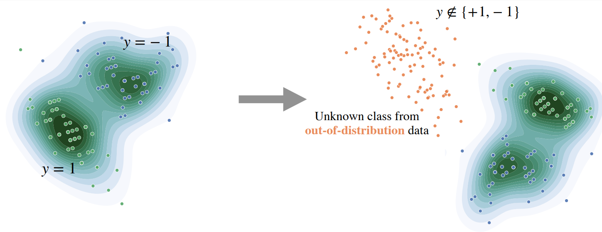

# GEM : GMM based Energy Measurement

This repository contains the code for **Provable guarantees for undrestanding out-of-distribution Detection** by *Peyman Morteza* and *Sharon Yixuan Li*. Major part of this codebase is based on [Energy-OOD](https://github.com/wetliu/energy_ood) and [Outlier-Exposure](https://github.com/hendrycks/outlier-exposure). 



## How to obtain GEM score?

* Please download the required data sets into ``./data/``.
* Run the following to see performance of GEM method on OOD data using a WideResNet pretrained on CIFAR-10:
```
bash run.sh GEM 0
```
* Run the following to see performance of GEM method on OOD data using a WideResNet pretrained on CIFAR-100:
```
bash run.sh GEM 1
```

## Experimental Result on CIFAR-10


| Model name         |     FPR95       |  AUROC  |  AUPR  |
| ------------------ |---------------- | --------| ------ |  
| Softmax score |     51.04      |  90.90 |  97.92  |  
| ODIN          |     35.71      |  91.09 |  97.62  |
| Mahalanobis   |     36.96      |  93.24 |  98.47  |
| Energy score  |     33.01      |  91.88 |  97.83  |
| GEM (ours)    |     37.21      |  93.23 |  98.47  |


## Experimental Result on CIFAR-100


| Model name         |     FPR95       |  AUROC  |  AUPR  |
| ------------------ |---------------- | --------| ------ |  
| Softmax score |     80.41      |  75.53 |  93.93  |  
| ODIN          |     74.64      |  77.43 |  94.23  |
| Mahalanobis   |     57.01      |  82.70 |  95.68  |
| Energy score  |     73.60      |  79.56 |  94.87  |
| GEM (ours)    |     57.03      |  82.67 |  95.66  |

