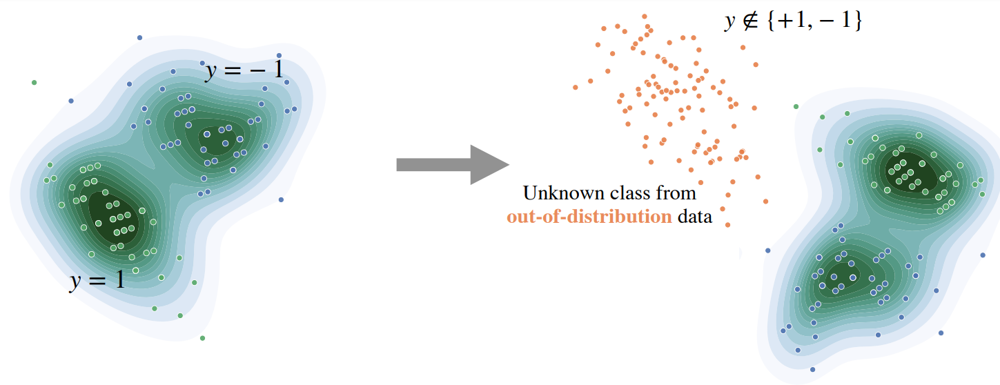

# GEM : GMM based Energy Measurement

This repository contains the code for *Provable guarantees for undrestanding out-of-distribution Detection* by *Peyman Morteza* and *Sharon Yixuan Li*. Substantial part of this codebase is based on [*Energy-based Out-of-distribution Detection (Energy OOD)*](https://github.com/wetliu/energy_ood). 

### Experimental Result

| Model name         |     FPR95       |  AUROC  |  AUPR  |
| ------------------ |---------------- | --------| ------ |  
| Softmax score |     51.04      |  90.90 |  97.92  |  
| ODIN          |     35.71      |  91.09 |  97.62  |
| Mahalanobis   |     36.96      |  93.24 |  98.47  |
| Energy score  |     33.01      |  91.88 |  97.83  |
| GEM (ours)    |     37.21      |  93.23 |  98.47  |
